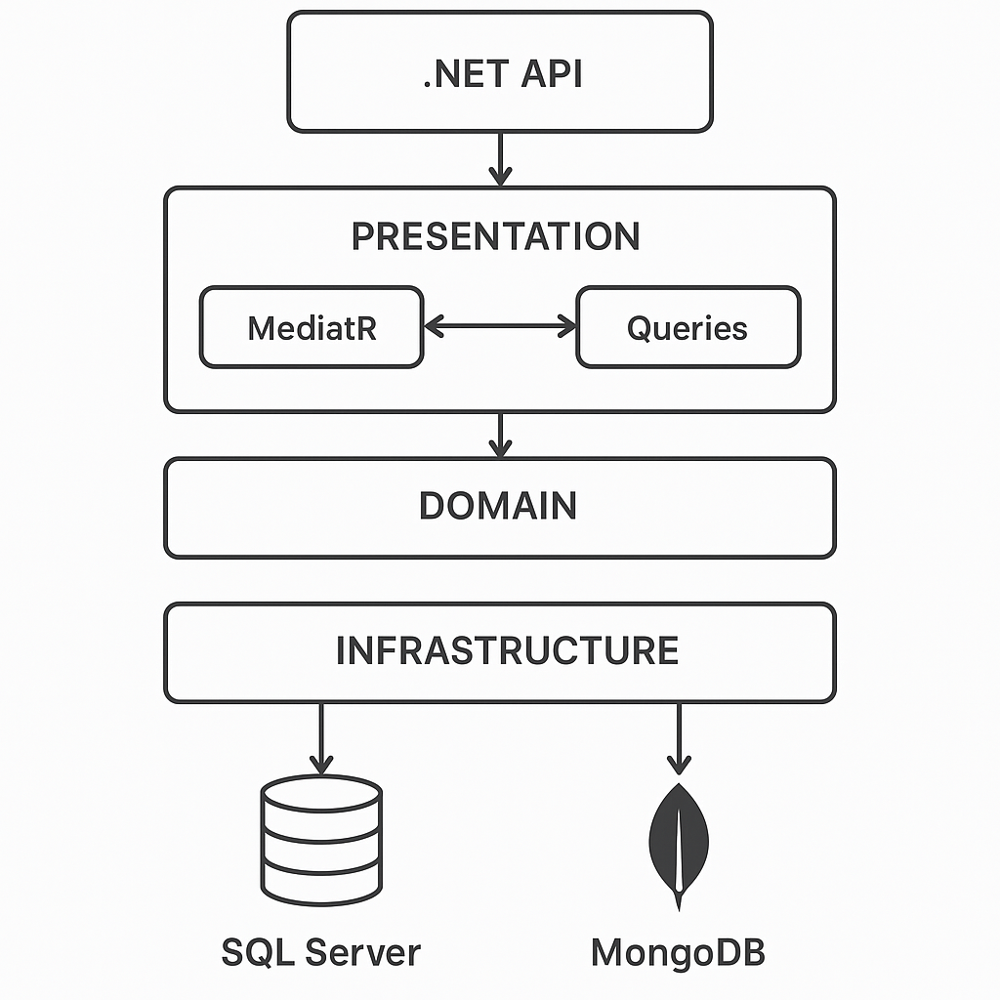

# 📘 EventLogger API (.NET 8)

A cloud-native event logging API built with .NET 8 minimal APIs, Entity Framework Core, CQRS/MediatR, and Azure serverless technologies. Supports structured event metadata in Azure SQL and flexible event details in MongoDB (Atlas or CosmosDB).

## 🧱 Architecture



## Project Structure

```
/
├── src/
│   ├── EventLogger.API/           --> Minimal API host
│   ├── EventLogger.Application/   --> CQRS, DTOs, MediatR logic
│   ├── EventLogger.Domain/        --> Domain models and interfaces
│   ├── EventLogger.Infrastructure/--> EFCore + MongoDB + DI
├── tests/
│   └── EventLogger.Tests/         --> Unit tests for Application logic
├── docker-compose.yml          --> Local SQL Server + MongoDB
├── README.md
└── SOLUTION.md
```

## ⚙️ Tech Stack

- [.NET 8 Minimal API](https://learn.microsoft.com/en-us/aspnet/core/)
- [Entity Framework Core](https://learn.microsoft.com/en-us/ef/core/)
- [MediatR + CQRS Pattern](https://github.com/jbogard/MediatR)
- [MongoDB Atlas or CosmosDB](https://www.mongodb.com/atlas)
- [Azure SQL Server](https://learn.microsoft.com/en-us/azure/azure-sql/)
- [Terraform](https://www.terraform.io/)
- [GitHub Actions](https://github.com/features/actions)
- [Swagger/OpenAPI](https://swagger.io/)

## 🚀 Quick Start (Local)

## Prerequisites

Before you begin, ensure you have the following installed:

- [.NET 8.0 SDK](https://dotnet.microsoft.com/download/dotnet/8.0)
- [Docker Desktop](https://www.docker.com/products/docker-desktop)

### 🔧 Run Locally

```bash
git clone https://github.com/your-org/eventlogger-api.git
cd eventLogger.api

# Restore NuGet packages
dotnet restore

# Build the solution
dotnet build

# Run unit tests
dotnet test

# This will spin up SQL & MongoDB
docker-compose up -d

dotnet run --project src/EventLogger.Api
```
Then visit:
👉 https://localhost:5001/swagger/index.html

### Local Databases

- **SQL Server**: Available on `localhost:1433`
  - Username: `sa`
  - Password: `Pass@word1`
- **MongoDB Local**: Available on `localhost:27017`

The API will be available at `https://localhost:5001` (or `http://localhost:5000`)


## Database Connection Details

### SQL Server
- **Host**: `localhost`
- **Port**: `1433`
- **Username**: `sa`
- **Password**: `Pass@word1`
- **Connection String**: `Server=localhost,1433;Database=EventLogsDb;User Id=sa;Password=Pass@word1;TrustServerCertificate=true;`

### MongoDB Local
- **Connection String**: `mongodb://localhost:27017`
